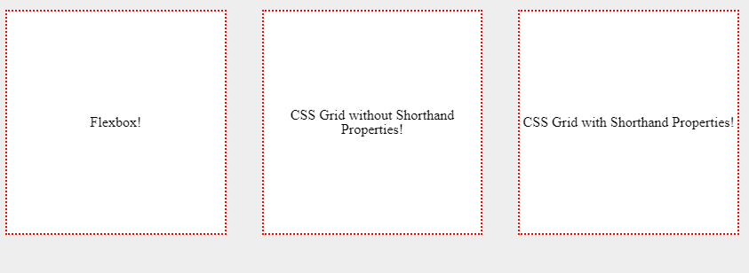

## 1. Flexbox với  ``margin-left: auto``

```html
// HTML
<header>
	<div class="logo"></div>
	<div class="menu"></div>
	<div class="user"></div>
</head
```
```css
header {
    display: flex;
}
.user {
    margin-left: auto;
}
```

## 2. CSS canh giữa 1 thành phần theo chiều ngang và dọc với code ngắn nhất:

```css
CSS

.container {
    display: flex;
    align-items: center;
    justify-content: center;
}
```
### 2.1 CSS Grid:
```css
.container {
    display: grid;
    align-items: center;
    justify-items: center;
}
```
Cái cách đặt tên properties của CSS Grid cũng dễ nhớ hơn nữa. Không những thế CSS Grid còn cung cấp shorthand properties cho 2 thuộc tính ```align-items``` và ```justify-items``` này bằng thuộc tính``` place-items```. Vậy code của chúng ta sẽ sửa lại như sau:

```css
.container {
    display: grid;
    place-items: center;
}
```


```html
<div class="wrapper">
  <div class="container flexbox">
    <h3>Flexbox!</h3>
  </div>
  <div class="container css-grid">
    <h3>CSS Grid without Shorthand Properties!</h3>
  </div>
  <div class="container css-grid-shortest">
    <h3>CSS Grid with Shorthand Properties!</h3>
  </div>
</div>
```
```css
body {
  background-color: #eee;  
}

.wrapper {
  display: flex;
}

.container {
  width: 350px;
  height: 250px;
  border: 2px dotted red;
  margin: 20px;
  background-color: #fff;
  text-align: center;
}

// Flexbox
.flexbox {
  display: flex;
  align-items: center;
  justify-content: center;
}

// CSS Grid without Shorthand Properties
.css-grid {
  display: grid;
  align-items: center;
  justify-items: center;
}

// CSS Grid with Shorthand Properties
.css-grid-shortest {
  display: grid;
  place-items: center;
}
```

## Horizontally
### Text in line
``` css
.center-children {
  text-align: center;
}

```
This will work for ```inline```, ```inline-block```, ``inline-table``, ```inline-flex```, etc.

```css
.center-text-trick {
  height: 100px;
  line-height: 100px;
  white-space: nowrap;
}
```

### Text multiple lines , table

```html
<table>
  <tr>
    <td>
      I'm vertically centered multiple lines of text in a real table cell.
    </td>
  </tr>
</table>

<div class="center-table">
  <p>I'm vertically centered multiple lines of text in a CSS-created table layout.</p>
</div>
```
```css
body {
  background: #f06d06;
  font-size: 80%;
}

table {
  background: white;
  width: 240px;
  border-collapse: separate;
  margin: 20px;
  height: 250px;
}

table td {
  background: black;
  color: white;
  padding: 20px;
  border: 10px solid white;
  /* default is vertical-align: middle; */
}

.center-table {
  display: table;
  height: 250px;
  background: white;
  width: 240px;
  margin: 20px;
}
.center-table p {
  display: table-cell;
  margin: 0;
  background: black;
  color: white;
  padding: 20px;
  border: 10px solid white;
  vertical-align: middle;
}
```
https://codepen.io/chriscoyier/pen/ekoFx


```html
<main>
  
  <div>
     I'm a block-level element with an unknown height, centered vertically within my parent.
  </div>
  
</main>
```


```css
.parent {
  position: relative;
}
.child {
  position: absolute;
  top: 50%;
  transform: translateY(-50%);
}
```
https://codepen.io/chriscoyier/pen/lpema


```html
<main>
  
  <div>
     I'm a block-level element of an unknown height and width, centered vertically within my parent.
  </div>
  
</main>
```
```css
.parent {
  position: relative;
}
.child {
  position: absolute;
  top: 50%;
  left: 50%;
  transform: translate(-50%, -50%);
}
```

## Nút với ảnh và chữ được căn giữa

```html
<a href="#" class="tbl-btn">
  <span></span>
  <span>Save everything!</span>
</a>
```
```css
.tbl-btn {
  display: table;
  color: black;
  text-decoration: none;
  padding: 12px 24px 12px 24px;
  background-color: #ffe6cc;
  border: solid 1px lightgray;
  border-radius: 4px;
}
.tbl-btn span {
  display: table-cell;
  vertical-align: middle;
}
.tbl-btn img {
  float: left;
  margin-right: 6px;
}
```
https://jsfiddle.net/hieuns/mo804yhw/?utm_source=website&utm_medium=embed&utm_campaign=mo804yhw

## Các thẻ input với nhãn được căn giữa (check box, radio)

```html
<div class="chkbxs-group-tbl">
  <div class="chkbxs-tbl">
    <span><input type="checkbox"/></span>
    <span>Option #1</span>
  </div>
  <div class="chkbxs-tbl">
    <span><input type="checkbox"/></span>
    <span>Option #2</span>
  </div>
  <div class="chkbxs-tbl">
    <span><input type="checkbox"/></span>
    <span>Option #3</span>
  </div>
</div>
```

```css
.chkbxs-group-tbl {
  display: inline-block;
  padding: 16px 32px 16px 24px;
  background-color: #ffe6cc;
  border: solid 1px lightgray;
  border-radius: 3px;
}
.chkbxs-tbl {
  display: table;
  font-size: 16px;
  padding: 0 0 4px 0;
}
.chkbxs-tbl > span {
  display: table-cell;
  vertical-align: middle;
}
.chkbxs-tbl > span:last-child {
  padding-left: 6px;
}
```
https://jsfiddle.net/hieuns/ot2uqsd4/?utm_source=website&utm_medium=embed&utm_campaign=ot2uqsd4

## Các thẻ input với nhãn được căn giữa (check box, radio)  2

```html
<div class="chkbxs-group-flex">
  <div class="chkbxs-flex">
    <input type="checkbox"/><span>Option #1</span>
  </div>
  <div class="chkbxs-flex">
    <input type="checkbox"/><span>Option #2</span>
  </div>
  <div class="chkbxs-flex">
    <input type="checkbox"/><span>Option #3</span>
  </div>
</div>
```

```css
.chkbxs-group-flex {
  display: inline-block;
  padding: 16px 32px 16px 24px;
  background-color: #f0fff0;
  border: solid 1px lightgray;
  border-radius: 3px;
}
.chkbxs-flex {
  display: flex;
  align-items: center;
  font-size: 16px;
  padding: 0 0 4px 0;
}
.chkbxs-flex > span {
  padding-left: 6px;
}
```
https://jsfiddle.net/hieuns/4gn0ohdr/?utm_source=website&utm_medium=embed&utm_campaign=4gn0ohdr

## Text content area tự xuống dòng
```css
  white-space: pre-wrap;
```
